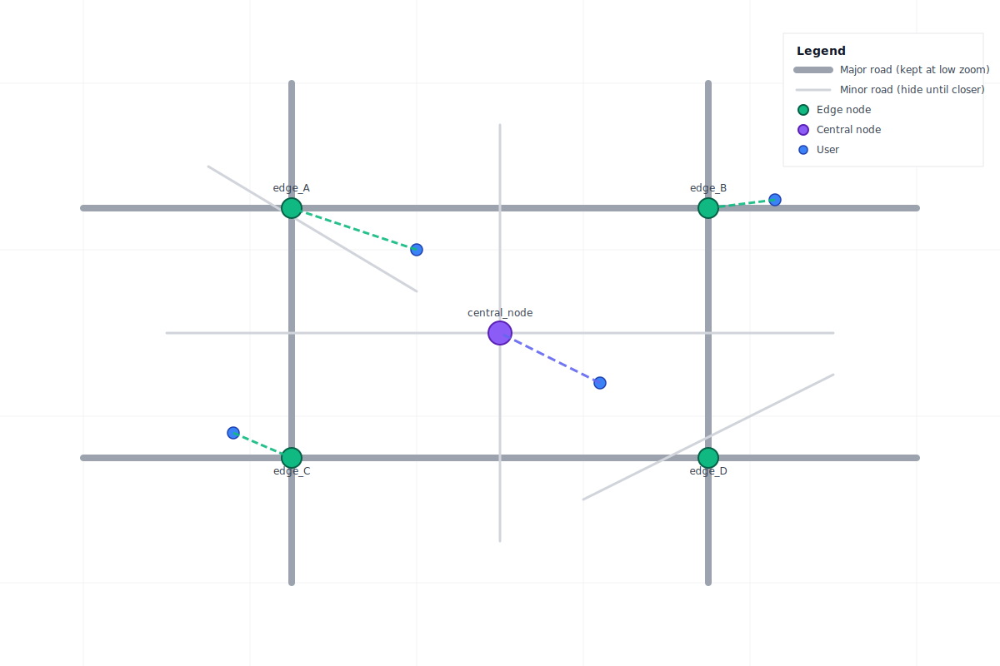
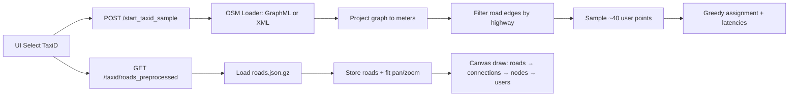
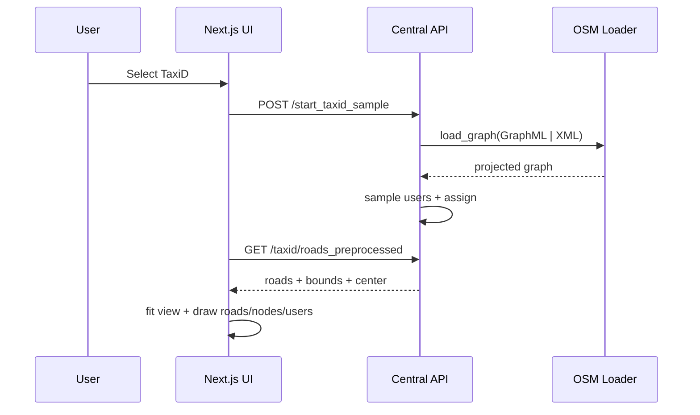

TaxiD Scenario (Beijing OSM) — Implementation & Usage

Overview
- Adds a new dataset option “TaxiD (Beijing OSM)” that displays the Beijing road network and spawns sample users on the map.
- Backend loads OSM (prefers GraphML cache), exposes fast roads endpoint (preprocessed JSON), and creates ~40 users sampled along roads.
- UI draws the roads and users; selection of “Dataset 5: TaxiD” triggers data loading automatically.

Key Files (added/updated)
- Backend
  - serverless-sim/config.py: DEFAULT_PIXEL_TO_METERS; TaxiD paths: TAXID_OSM_XML_PATH, TAXID_GRAPHML_PATH, TAXID_ROADS_JSON_GZ_PATH; viewport defaults.
  - serverless-sim/central_node/control_layer/helper_module/osm_loader.py: OSM loader (prefers GraphML, fallback XML with LFS detection, projection, in‑memory cache, optional GraphML save).
  - serverless-sim/central_node/control_layer/controller_module/start_taxid_sample_controller.py: Spawns users along roads; recenters central node; logs progress.
  - serverless-sim/central_node/control_layer/controller_module/get_taxid_roads_controller.py: Builds roads polylines dynamically from graph (meters→pixels) with filters; logs counts.
  - serverless-sim/central_node/control_layer/controller_module/get_taxid_roads_preprocessed_controller.py: Serves preprocessed roads JSON (gz) from TAXID_ROADS_JSON_GZ_PATH.
  - serverless-sim/central_node/control_layer/controller_module/central_core_controller.py: Bridges controllers with API.
  - serverless-sim/central_node/control_layer/routes_module/central_route.py: Adds routes:
    - POST /api/v1/central/start_taxid_sample
    - GET  /api/v1/central/taxid/roads
    - GET  /api/v1/central/taxid/roads_preprocessed
  - serverless-sim/scripts/preprocess_taxid_map.py: Preprocess script (GraphML + roads.json.gz) from bbox or XML.
  - serverless-sim/central_node/control_layer/controller_module/create_user_node_controller.py: Fix manual add-user to use greedy assignment.

- UI
  - simulation-ui/lib/draw/draw-roads.js: Draws roads with zoom-aware stroke and culling.
  - simulation-ui/lib/canvas-drawing.js: Calls drawRoads() before nodes/users.
  - simulation-ui/lib/simulation-management/start-sample.js: startTaxiDSample() → POST /start_taxid_sample.
  - simulation-ui/lib/simulation-management/load-taxid-roads-preprocessed.js: Loads roads_preprocessed; stores and auto-fits view.
  - simulation-ui/lib/simulation-management/load-taxid-roads.js: Dynamic loader (fallback) when preprocessed missing.
  - simulation-ui/lib/simulation-management/index.js: Exports loaders and startTaxiDSample.
  - simulation-ui/components/simulation/control-cards/DatasetSelectionCard.jsx: Adds “Dataset 5: TaxiD (Beijing OSM)” and calls POST + roads_preprocessed (fallback to dynamic).

Coordinate System & Rendering
- Graph nodes/edges are in meters after projection. The loader/script converts to pixels via:
  - x_px = (x_m − minx) / DEFAULT_PIXEL_TO_METERS
  - y_px = (maxy − y_m) / DEFAULT_PIXEL_TO_METERS (north‑up visually)
- DEFAULT_PIXEL_TO_METERS (config) = 10 → 1 px ≈ 10 m.
- UI draws roads under nodes; panning/zooming keeps roads and nodes aligned.

How Users Are Generated
- On POST /start_taxid_sample:
  1) Load graph (GraphML preferred; else XML; project to metric CRS). Recenters central node to bbox center.
  2) Filter edges by highway ∈ {motorway,trunk,primary,secondary,tertiary,residential,unclassified}.
  3) Sample ~40 points along random edge segments; convert to pixels.
  4) Create UserNodeInfo objects (size≈8, speed≈5) at sampled locations.
  5) Run scheduler.node_assignment() to assign users and update latencies.

Preprocessing (recommended for speed)
- Generate GraphML + roads.json.gz once (Windows PowerShell examples):
  - From bbox:
    python serverless-sim/scripts/preprocess_taxid_map.py --bbox 40.084 39.756 116.813 116.127 --graphml predict-model-with-taxi/osm/beijing_taxid.graphml --roads-json predict-model-with-taxi/osm/beijing_taxid_roads.json.gz
  - From XML:
    python serverless-sim/scripts/preprocess_taxid_map.py --xml "predict-model-with-taxi/planet_116.127,39.756_116.813,40.084.osm/planet_116.127,39.756_116.813,40.084.osm" --graphml predict-model-with-taxi/osm/beijing_taxid.graphml --roads-json predict-model-with-taxi/osm/beijing_taxid_roads.json.gz

Backend Setup & Run
- Optional env vars (set before starting backend):
  - $env:TAXID_GRAPHML_PATH = (Resolve-Path 'predict-model-with-taxi/osm/beijing_taxid.graphml').Path
  - $env:TAXID_ROADS_JSON_GZ_PATH = (Resolve-Path 'predict-model-with-taxi/osm/beijing_taxid_roads.json.gz').Path
  - $env:TAXID_OSM_XML_PATH = 'C:\\path\\to\\planet_...osm'  # only if using XML fallback
- Start:
  - python serverless-sim\central_main.py --port 8000 --log-level INFO
- Test endpoints:
  - Invoke-RestMethod -Method Post http://127.0.0.1:8000/api/v1/central/start_taxid_sample
  - Invoke-RestMethod -Method Get  http://127.0.0.1:8000/api/v1/central/taxid/roads_preprocessed
  - Invoke-RestMethod -Method Get  http://127.0.0.1:8000/api/v1/central/get_all_users

UI Setup & Run
- simulation-ui/.env.local:
  - NEXT_PUBLIC_API_URL=http://127.0.0.1:8000
- Start UI:
  - cd simulation-ui && npm run dev
- In the app, choose “Dataset 5: TaxiD (Beijing OSM)”.
  - UI calls POST /start_taxid_sample then GET /taxid/roads_preprocessed (fallback to /taxid/roads if missing JSON).

Troubleshooting
- Pending requests on first run:
  - If using XML only, the first parse is slow. Prefer GraphML + preprocessed JSON.
- 400 on start_taxid_sample:
  - OSM file is a Git LFS pointer. Run: git lfs install; git lfs pull; git lfs checkout; or set TAXID_GRAPHML_PATH.
- No roads drawn:
  - Ensure TAXID_ROADS_JSON_GZ_PATH points to the generated file; or rely on dynamic /taxid/roads fallback (slower).
- Manual add-user 500 (old bug):
  - Fixed by using greedy assignment internally.

Performance Tips
- roads.json.gz size depends on road density; preprocessor applies light quantization (0.1 px). Increase to 0.2–0.5 for smaller files.
- Reduce highway types for sparser maps (e.g., drop residential/unclassified).

Change Log Summary
- New controllers, routes, and script to support TaxiD.
- Loader improved for GraphML preference, XML LFS detection, projection, and caching.
- UI gains road drawing, preprocessed fast path, and dataset option.

Notes
- DEFAULT_PIXEL_TO_METERS syncs meter→pixel conversion across backend/preprocessor/UI.
- Future improvement: UI toggle for “Show roads” or “Major vs All roads” and button to “Reload TaxiD (preprocessed)”.

Charts
- Demo layout (SVG):
  - 

- System Flow (Mermaid):


- Preprocess Pipeline (Mermaid):
```mermaid
flowchart TD
  X1[Input: bbox or OSM XML] --> X2[Load graph]
  X2 --> X3{Projected?}
  X3 -- no --> X4[Project graph]
  X3 -- yes --> X5
  X4 --> X5[Save GraphML cache]
  X5 --> X6[Extract road edges (allowed highway)]
  X6 --> X7[Convert (m)→(px) via DEFAULT_PIXEL_TO_METERS]
  X7 --> X8[Quantize coords (e.g. 0.1 px)]
  X8 --> X9[Write roads.json.gz]
```

- Runtime Sequence (Mermaid):

